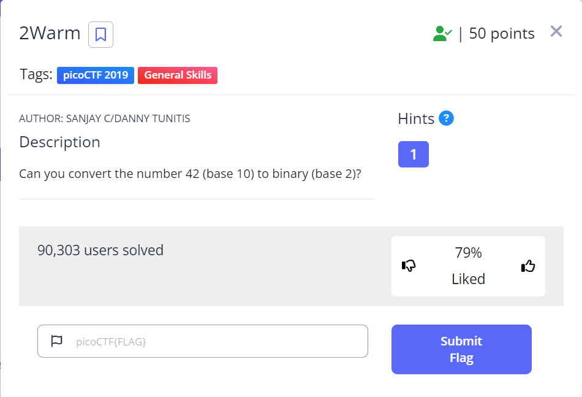

# 2Warm

| **Points** |    **Category**      |    **Level** |
|--------|----------------|-------|
| 50 :muscle:     | General Skills :tools: | Easy :grin: |



1. **Step 1: Go to [this site](https://www.rapidtables.com/convert/number/base-converter.html)**
   
    

> Alternatively, if you want to solve it without a website you can manually subnet it:
    

---

**Here's the flag:**
```text
picoCTF{101010}
```
