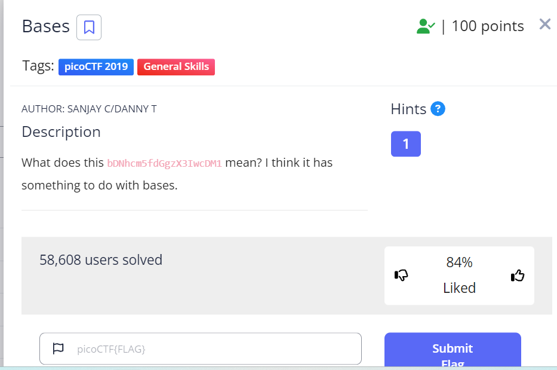
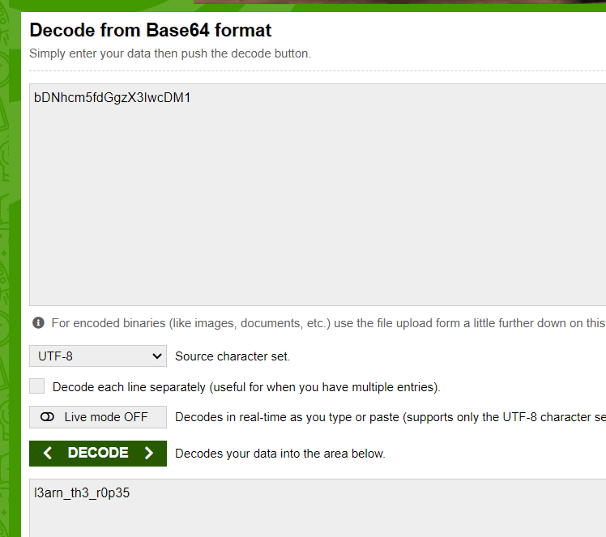

# Bases

| **Points** |	**Category**      |	**Level** |
|--------|----------------|-------|
| 100 💪	 | General Skills 🛠️ | Easy 😁 |



They stated in the decription of the CTF that the text `bDNhcm5fdGgzX3IwcDM1` is in *some base*,i guessed its `base64`, theb I used [this site](https://www.base64decode.org/) to decrypt it.



---

**Here's the flag:**

```text
picoCTF{l3arn_th3_r0p35}
```

---

<br>

[](/)
