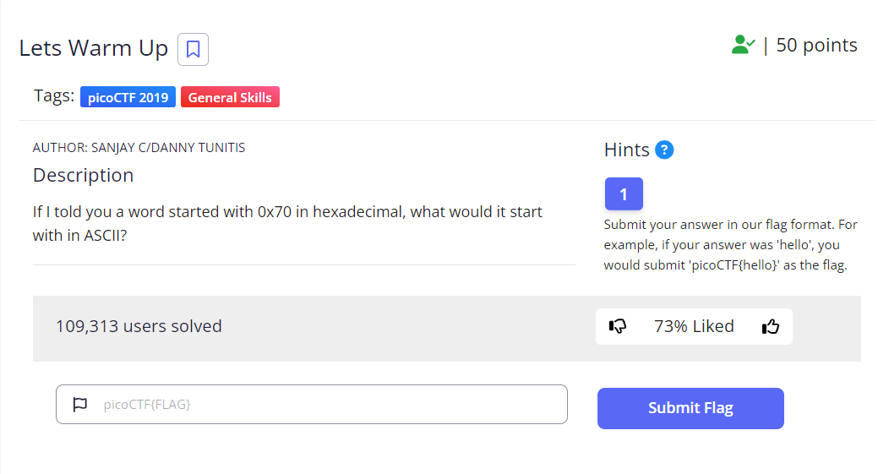

# Lets Warm Up

| **Points** |    **Category**      |    **Level** |
|--------|----------------|-------|
| 50 :muscle:     | General Skills 🛠️ | Easy :grin: |



1. **Step 1: Go to [this site](https://www.asciitable.com/)**
   
    

3. **Step 2: search for the hexadecimal value of 70. (p)**

---

**Here's the flag:**
```text
picoCTF{p}
```

---

<br>

[](/)
