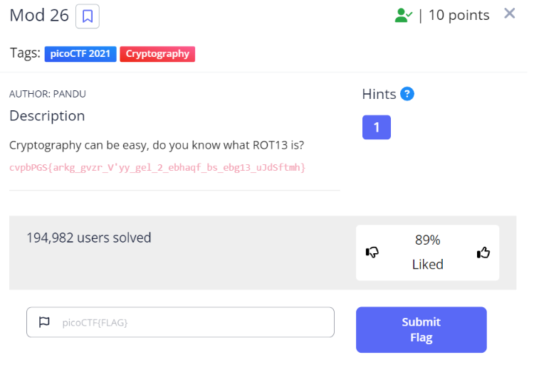
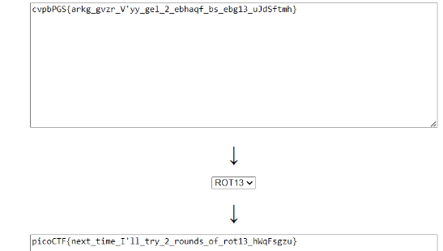

# Mod 26

| **Points** |    **Category**      |    **Level** |
|--------|----------------|-------|
| 10 :muscle:     | Cryptography 🔑 | Easy :grin: |



As we can see in the image above, the flag is encrypted, and they told us they encrypted it using **ROT13**.<br>
I referred to [this site](https://rot13.com/), and paste the encrypted flag on to it.



---

**Here's the flag:**
```text
picoCTF{next_time_I'll_try_2_rounds_of_rot13_hWqFsgzu}
```
