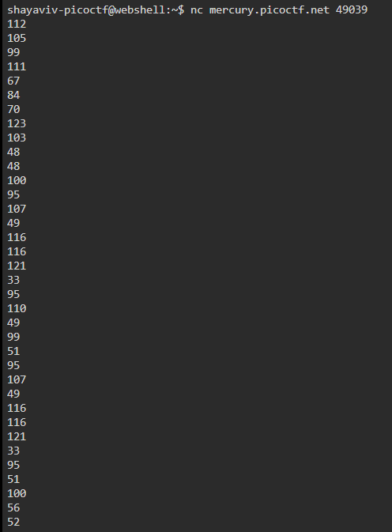

# Nice netcat...

| **Points** |    **Category**      |    **Level** |
|--------|----------------|-------|
| 15 :muscle:     | General Skills :tools: | Easy :grin: |


1. **Step 1: Run the given command, `nc mercury.picoctf.net 49039`, you should get a list of numbers.**
    

    > **Results:**
    > ```text
    > 112 105 99 111 67 84 70 123 103 48 48 100 95 107 49 116 116 121 33 95 110 49 99 51 95 107 49 116 116 121 33 95 51 100 56 52 101 100 99 56 125
    > ```

2. **Step 2: Go to [this site]((https://codebeautify.org/ascii-to-text)) and copy paste the list of the numbers in the decoder.**
    

---

**Here's the flag:**
```text
picoCTF{g00d_k1tty!_n1c3_k1tty!_3d84edc8}
```
