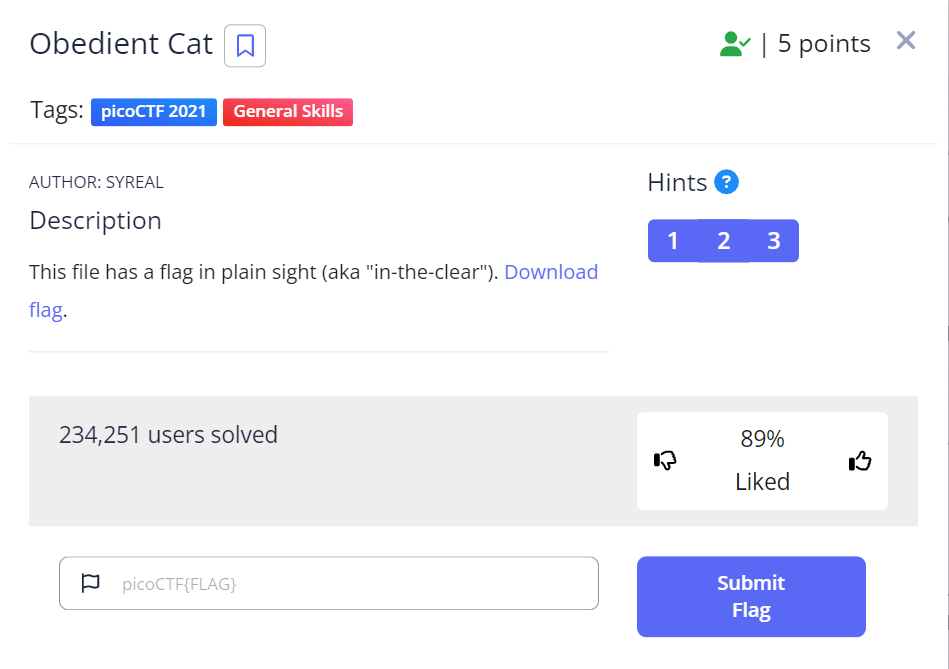
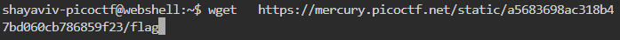
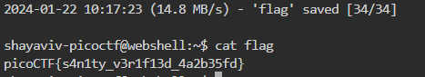

# Obedient Cat

| **Points** |    **Category**      |    **Level** |
|--------|----------------|-------|
| 5 :muscle:     | General Skills 🛠️ | Easy :grin: |



1. **Step 1: Copy the Link for the file**
    

2. **Step 2: Open the file using the `cat` Command**
    

---

**Here's the flag:**
```text
picoCTF{s4n1ty_v3r1f13d_4a2b35fd}
```

---

<br>

[](/)
