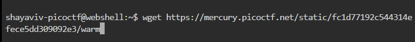

# Wave a flag

| **Points** |    **Category**      |    **Level** |
|--------|----------------|-------|
| 10 :muscle:     | General Skills :tools: | Easy :grin: |


1. **Step 1: Download the link using the `wget` command**
    

2. **Step 2: Changing File Permissions**
    To allow execution of the `warm` file, you first need to ensure it has the execute bit turned on.<br>
    And follow these steps:

    1. **Download the 64-bit ELF Executable File**

    2. **Change File Permissions**
        To grant execute permissions to the file, use the `chmod` command.<br>
        Open your terminal and navigate to the directory containing the file, then run the following command:
        

3. **Step 3: Use `./warm` to execute the binary.
    

    1. As stated in the CTF, we'll use the `-h` option. (`./warm -h`)
        

---

**Here's the flag:**
```text
picoCTF{b1scu1ts_4nd_gr4vy_6635aa47}
```
